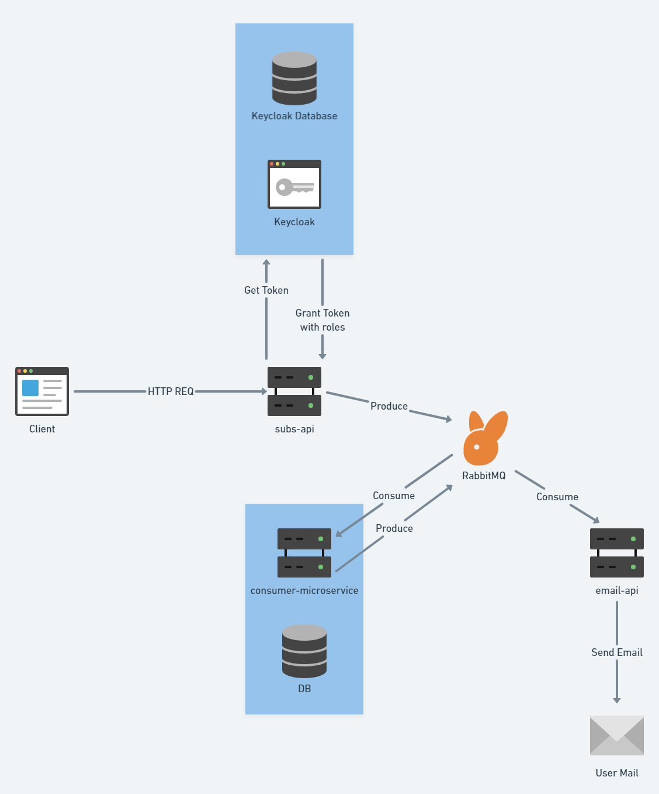

# Subsapi


## Sumary 

- [Trail Backend Ascan](#trail-backend-ascan)
  - [About the project](#about-the-project)
  - [Project architecture](#project-achitecture)
  - [Technologies](#technologies)
  - [Building](#building)
    - [How to build](#how-to-build)
    - [Building with Docker Compose](#building-with-docker-compose)
  - [Docker](#docker)
    - [Get Started](#get-started)
    - [Useful Docker Commands](#useful-docker-commands)
- [Project Goals](#project-goals)
  - [My Extra Goals](#my-extra-goals)

# Trail Backend Ascan

This is an open project to conclude a trail for a Intern formation at
[Instituto Altântico](https://www.atlantico.com.br/).


## About the project

This is a project that simulates a subscription service, with registration, purchase, cancel and recover of a
subscription. I've used the microservices architecture to build it and did the communication among the services with
a message broker. There is also a microservice to consume these subscriptions changes and persist the data and then
produce a message to message broker that will be consumed by a notification microservice that send the changes to
user email.

## Project achitecture


## Technologies

- RabbitMQ
- SpringBoot
- Postgres
- Keycloak
- Docker

## Building

```bash
$ mvn clean install
```

### How to build

After building the project using Maven, you'll need to build the container using Docker or Docker Compose.

### Building with Docker Compose

To build the project withh all its linked services (Postgres and Microservice):

```bash
$ docker-compose up --build
```

## Docker

### Get Started

* [Docker](https://docs.docker.com/userguide)
* [Dockerfile](https://docs.docker.com/reference/builder)

### Useful Docker commands

```
docker images
docker ps
docker exec -it ${containerName} bash
```

# Project Goals

- [x] API Rest
- [x] Message broker
- [x] Microservice to persist data
- [ ] Unit tests
- [ ] Functional tests

## My Extra Goals

- [x] Microservice to notify subscription change
- [x] Keycloak
- [ ] Swagger API Documentation
- [ ] Elastic Stack for Logging
- [ ] CI/CD Pipelines

<br><br><br><br>
<h2 align="center">Breno Araripe</strong>
<h6 align="center">"Some people feel the rain. Others just get wet."</h4>

[](https://github.com/brenoma)
[](https://www.linkedin.com/in/brenoma)